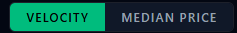
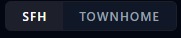
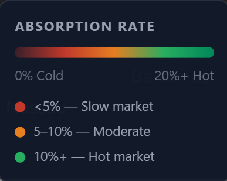
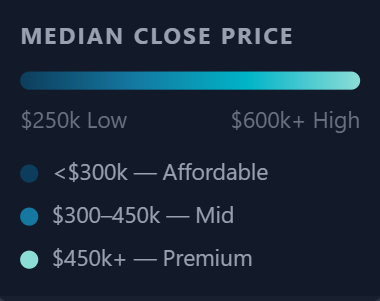
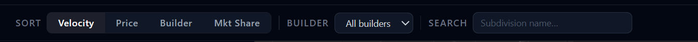
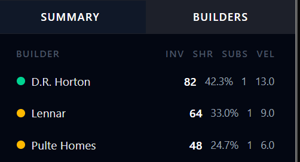
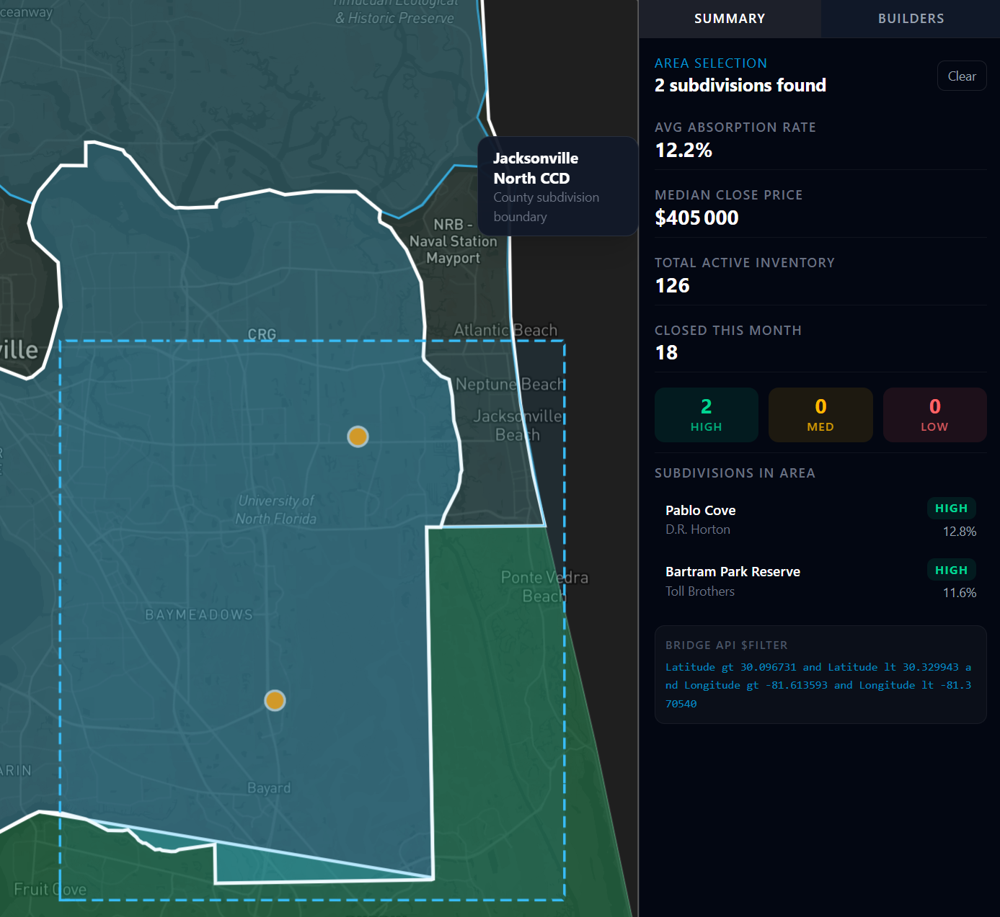

# Florida New Construction Analytics Platform — Manager Report

**Date:** April 9, 2026
**Status:** Layer 1 MVP — Functional with mock data, Bridge API integration scaffolded

---

## What the App Does

An interactive web dashboard that tracks new residential construction activity across **23 Florida counties**. It displays a color-coded map (choropleth heatmap) with two core analytics:

1. **Sales Velocity (Absorption Rate)** — how fast available inventory is being sold each month
2. **Median Close Price** — median sale price of closed transactions


Users can filter by **home type** (Single-Family Home vs. Townhome) and switch between the two metrics. Clicking a county pulls up a detail card with full stats and month-over-month trends.

## 

## What Each Color Means

### Velocity / Absorption Rate Map

| Color                | Rate | Market Signal          |
| -------------------- | ---- | ---------------------- |
| Dark Red `#3a1f2a`   | ~0%  | Cold — very slow sales |
| Red `#c0392b`        | ~3%  | Slow market (below 5%) |
| Orange `#e67e22`     | ~7%  | Moderate (5–10%)       |
| Green `#27ae60`      | ~12% | Hot market (above 10%) |
| Dark Green `#00875a` | 20%+ | Very hot — high demand |



### Median Price Map

| Color                 | Price Range | Segment    |
| --------------------- | ----------- | ---------- |
| Dark Blue `#0d3d5c`   | ~$250k      | Affordable |
| Medium Blue `#1478a0` | ~$350k      | Mid-range  |
| Cyan `#00b4c8`        | ~$450k      | Upper mid  |
| Light Cyan `#8cddd6`  | $600k+      | Premium    |





## Data: Where It Comes From

### Primary Source — Bridge Data Output (MLS Feed)

The app is wired to **Bridge Interactive's RESO Web API** (OData format), which aggregates MLS listings from:

- **Stellar MLS** — covers Central & Southwest Florida
- **NE Florida MLS** — covers the Jacksonville metro area

For each county, the backend makes **3 parallel API calls** per request:

1. Active listings count (current inventory)
2. Closed sales this month (with close prices)
3. Closed sales last month (for month-over-month delta)

All metric computation (absorption rate, median price, velocity tier) happens server-side in Node.js — not on the frontend.

### Fallback — Mock Data

When Bridge credentials are not configured, the app automatically uses realistic mock data covering all 23 counties (March 2026 figures), with realistic SFH vs. Townhome differentials (~12% lower prices and absorption for townhomes).

# Layer 2 :

### List of subdivisions:

### List of builders :

- to select the Builder name:
  > GET /{dataset}/Property?$top=10&$select=BuilderName
- For exact county:
  > GET /api/v2/OData/{dataset}/Property?$filter=CountyOrParish eq 'Orange'&$select=BuilderName,CountyOrParish,SubdivisionName&
- For exact subdivision:
  > GET /api/v2/OData/{dataset}/Property?$filter=SubdivisionName eq 'Storey Park'&$select=BuilderName,SubdivisionName
  > -> the bridge API give us the possibility to get a liste of buildes in a subdivision or a county by name.

## 

# Layer 3 :

### Selection of a location:

> GET /api/v2/OData/{dataset}/Property

    ?access_token=...
    &$filter=Latitude gt 28.30 and Latitude lt 28.55
             and Longitude gt -81.45 and Longitude lt -81.15
    -> this one select the properties that are present within a selected Geo cart.



## Covered Counties (23 Total)

| Region               | Counties                                                                                                                |
| -------------------- | ----------------------------------------------------------------------------------------------------------------------- |
| Central/Southwest FL | Orange, Osceola, Seminole, Lake, Polk, Hillsborough, Manatee, Pasco, Hernando, Brevard, Volusia, Citrus, Marion, Sumter |
| Northeast FL         | Duval, St. Johns, Clay, Nassau, Baker, Alachua, Flagler                                                                 |
| Treasure Coast       | St. Lucie, Indian River                                                                                                 |

### County Geolocation Source

The map polygon boundaries for all 23 counties are **generated once** via a script and stored locally at `public/data/fl-counties.geojson`.

**How it works (`scripts/generate-fl-geojson.mjs`):**

1. Fetches the full US counties GeoJSON dataset (~7 MB) from a public Plotly/GitHub CDN
2. Filters it down to only the 23 target Florida counties by FIPS code
3. Injects the county name into each feature's `properties`
4. Writes the result to `public/data/fl-counties.geojson`

**Source URL:**

```text
https://raw.githubusercontent.com/plotly/datasets/master/geojson-counties-fips.json
```

**Run once with:**

```bash
node scripts/generate-fl-geojson.mjs
```

The output file is already committed to the repo — this script only needs to be re-run if the county list changes.

## Tech Stack

| Layer              | Technology                         |
| ------------------ | ---------------------------------- |
| Frontend Framework | Next.js 16 / React 19              |
| Map Rendering      | Mapbox GL JS v3 (WebGL choropleth) |
| State Management   | Redux Toolkit                      |
| Data Fetching      | React Query (5-min cache)          |
| Styling            | Tailwind CSS                       |
| Backend API        | Next.js API Routes (Node.js)       |

---

## Current Build Status

| Item                                | Status                                                 |
| ----------------------------------- | ------------------------------------------------------ |
| Choropleth map with 23 counties     | ✅ Done                                                |
| Velocity ↔ Median Price toggle     | ✅ Done                                                |
| SFH ↔ Townhome toggle              | ✅ Done                                                |
| County ranking list with MoM deltas | ✅ Done                                                |
| County spotlight detail card        | ✅ Done                                                |
| Mock data (fully functional)        | ✅ Done                                                |
| Bridge API integration scaffolded   | ✅ Done                                                |
| Bridge credentials connected        | ❌ we need `BRIDGE_DATASET_ID` + `BRIDGE_SERVER_TOKEN` |
| Live data validation                | ❌ No data access                                      |
| Layer 2 (county drill-down)         | ✅ Done                                                |
| Layer 3 (subdivision snapshot)      | ⏳ Selection area implimented (need snapshot data)     |
| Layer 4 (historical time-series)    | 🔲 future                                              |
